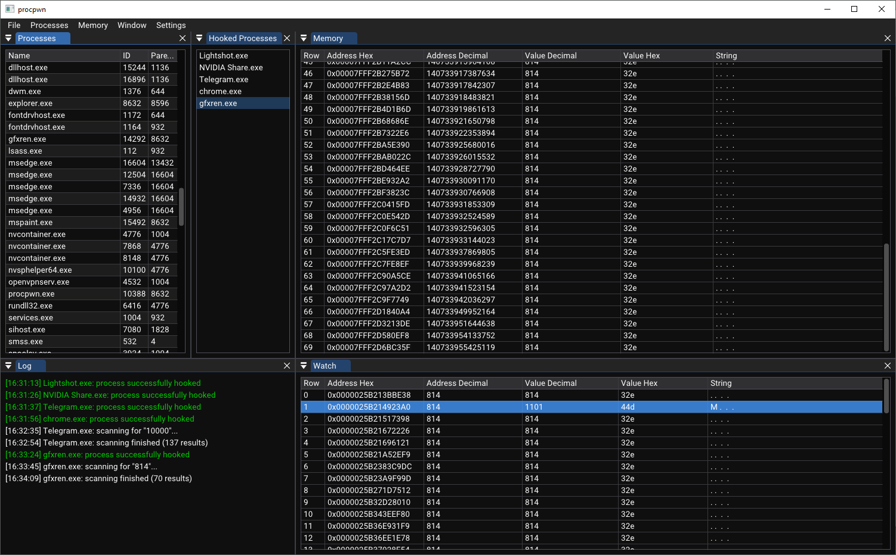

# procpwn
**Process memory hacking utility based on ImGui library** 
Current project state: in development 
</img>

## **Build Requirements (tested)** 

- Windows 64-bit operating system
- Windows SDK 10.0
- Visual Studio Community 2022
- OpenGL 3.3 compatible video adapter

## **Features Implemented** 
- Acquiring processes and their info from the operating system 
- Scanning for specific decimal values 
- Watching changes in memory in real time 

## **Module Info** 
| Directory | Information |
|---|---|
|[`gui`](https://github.com/hexahero/procpwn/tree/master/src/gui)        		|Contains implementation for all GUI entities|
|[`memnproc`](https://github.com/hexahero/procpwn/tree/master/src/memnproc)    	|Components that are used to communicate with operating system and other processes|
|[`util`](https://github.com/hexahero/procpwn/tree/master/src/util)    			|Utility features: logging, paths, string conversions, time etc.|
|[`window`](https://github.com/hexahero/procpwn/tree/master/src/window)        	|Application's OpenGL backend|

## **Roadmap** 
- Support for different data types 
- Memory editing 
- DLL injection 
